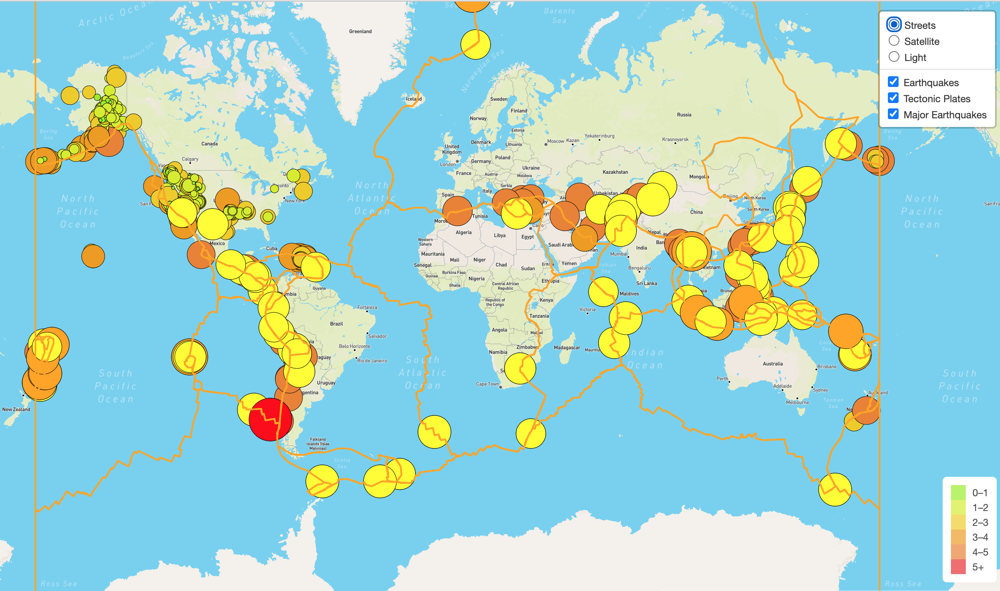

# Mapping_Earthquakes

## Project Overview
Using Leaflet and Mapbox, wrote a code to show earthquake data for the last 7 days, major earthquakes and tectonic plates. 

## Resources
Data Source: USGS Earthquake data and Repo for tectonic plate data - both json files

Software: Visual Studio Code 1.63.2, Leaflet, MapBox

## Results

After building a general map with the street view using MapBox, earthquake data from USGS is added as a layer. A tectonic plate layer and a layer with major earthquakes (magnitude of 4.5+) are added as well. The lines, weight, and circles are all styled in such a way that will stand out on all maps. There are 3 options for the map view - street, satellite and light. Street view is the default that loads automatically. 

The final map looks like this: 
